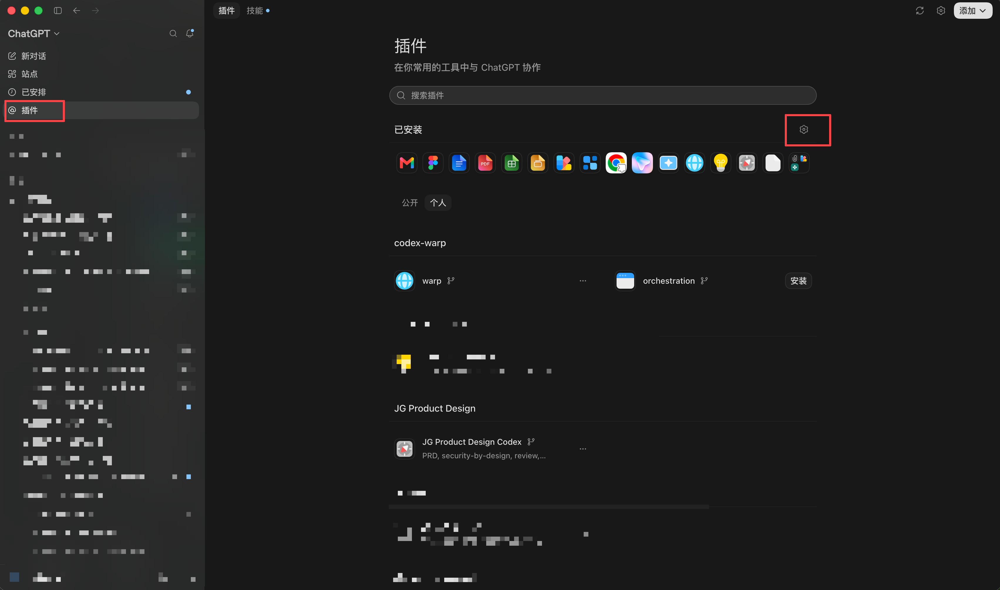
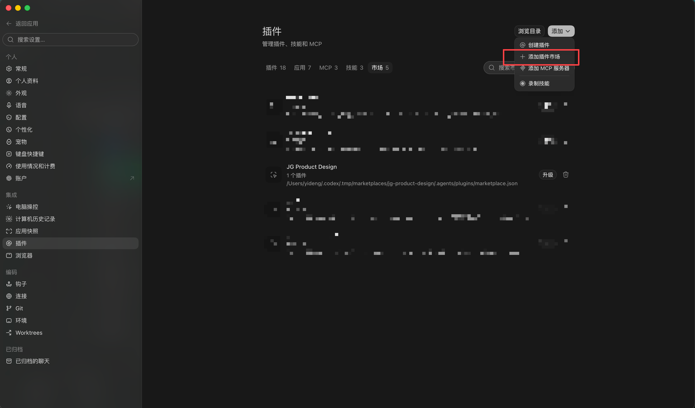
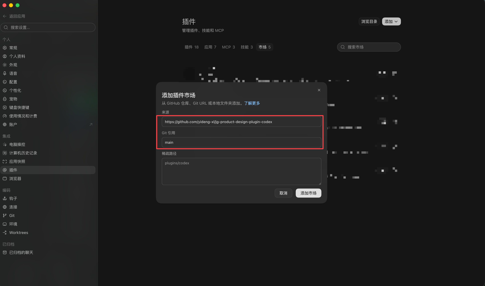
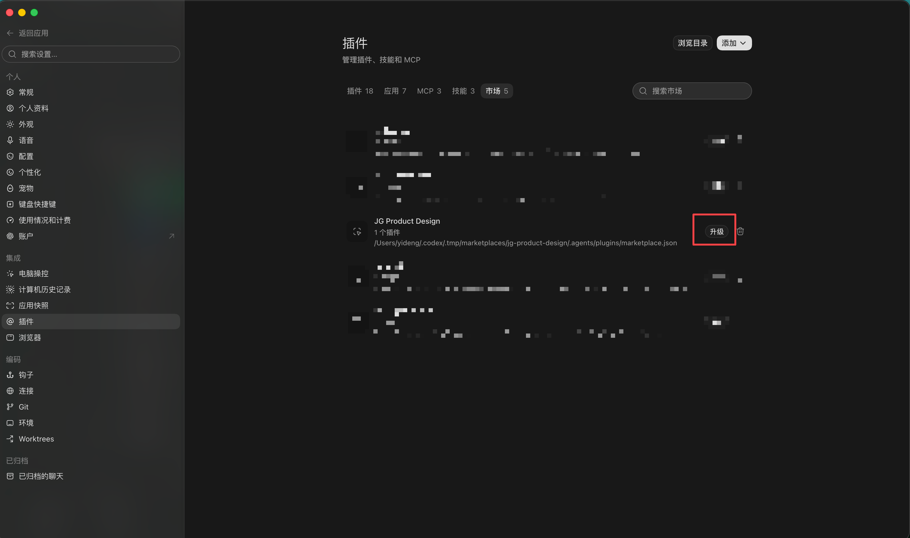

# JG Product Design Codex 插件市场安装与更新操作手册

适用于第一次添加 JG Product Design 插件市场，以及后续获取新版插件。

网页版：<https://yideng-xl.github.io/jg-product-design-plugin-codex/>

## 一、操作前准备

添加插件市场时按下表填写：

| 字段 | 填写内容 |
|---|---|
| 来源 | `https://github.com/yideng-xl/jg-product-design-plugin-codex` |
| Git 引用 | `main` |
| 稀疏路径 | 留空 |

插件市场和插件本体是两层：

- 插件市场负责提供版本信息。
- 插件本体是实际使用的能力。

首次安装和日常更新都要确认插件本体已安装或已刷新。

## 二、首次安装

### 1. 打开插件设置

进入 Codex 左侧的“插件”，再点击插件页面右上方的齿轮图标。



### 2. 选择“添加插件市场”

在设置页进入“插件”→“市场”，点击右上角“添加”，选择“添加插件市场”。

如果市场列表里已经有 JG Product Design，不要重复添加，直接按“日常更新”操作。



### 3. 填写市场来源

来源填仓库地址，Git 引用填 `main`，稀疏路径留空。确认后点击“添加市场”。



### 4. 安装插件

返回插件页面，在 JG Product Design 下找到 **JG Product Design Codex**，点击“安装”。安装完成后新建一个 Codex 任务。

首次安装完成标准：

- 市场列表中能看到 JG Product Design。
- 插件页面中 JG Product Design Codex 显示为已安装。

## 三、安装后验证

新建任务，输入：

```text
我们来聊个新需求
```

预期结果：Codex 先建议使用 `requirements2prd`，得到你的确认后再进入需求梳理流程。

## 四、日常更新

仓库发布新版本后，按“升级市场 → 刷新插件 → 新建任务”的顺序操作。

### 1. 升级插件市场

进入“设置”→“插件”→“市场”，找到 JG Product Design，点击右侧“升级”。



### 2. 刷新插件本体

返回插件页面，找到 JG Product Design Codex：

- 页面出现“升级”时，点击升级。
- 没有升级入口但新版能力未生效时，重新安装一次。

只升级市场不等于插件本体已经更新。市场升级后，仍要确认插件已刷新。

### 3. 新建任务验证

插件刷新完成后新建任务，再验证本次新增或调整的能力。已经打开的旧任务可能仍使用更新前的 skill。

## 五、命令行备用方式

界面中无法完成升级时，可在终端依次执行：

```bash
codex plugin marketplace upgrade jg-product-design
codex plugin add jg-product-design-plugin-codex@jg-product-design
```

执行完成后，新建 Codex 任务验证。

## 六、异常处理

| 现象 | 处理方式 |
|---|---|
| 提示市场已存在 | 不要重复添加。回到市场列表，找到 JG Product Design 并点击“升级”。 |
| 添加市场失败 | 核对仓库地址、`main` 和空白稀疏路径，并确认当前网络能访问 GitHub。 |
| 看不到新版能力 | 先升级市场，再刷新或重新安装插件，最后新建任务。 |
| 插件列表里找不到 | 确认市场列表中已有 JG Product Design。必要时先升级市场，再返回插件页搜索。 |
